# [📈 Live Status](https://status.cubari.moe): <!--live status--> **🟧 Partial outage**

This repository contains the open-source uptime monitor and status page for [Subject F](https://status.cubari.moe), powered by [Upptime](https://github.com/upptime/upptime).

With [Upptime](https://upptime.js.org), you can get your own unlimited and free uptime monitor and status page, powered entirely by a GitHub repository. We use [Issues](https://github.com/subject-f/cubari-status-page/issues) as incident reports, [Actions](https://github.com/subject-f/cubari-status-page/actions) as uptime monitors, and [Pages](https://status.cubari.moe) for the status page.

<!--start: status pages-->
<!-- This summary is generated by Upptime (https://github.com/upptime/upptime) -->
<!-- Do not edit this manually, your changes will be overwritten -->
<!-- prettier-ignore -->
| URL | Status | History | Response Time | Uptime |
| --- | ------ | ------- | ------------- | ------ |
|  Cubari | 🟩 Up | [cubari.yml](https://github.com/subject-f/cubari-status-page/commits/HEAD/history/cubari.yml) | 

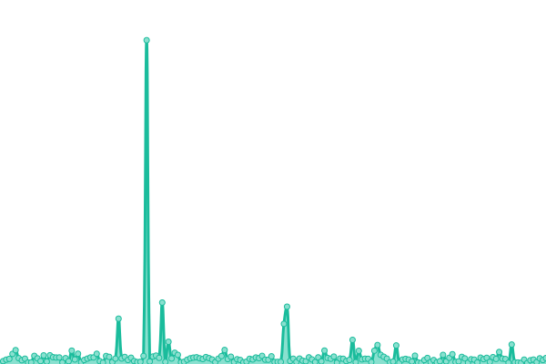 1626ms
     
 | 

<a href="https://status.cubari.moe/history/cubari">100.00%</a>
    

|  Cubari (MangaDex) | 🟩 Up | [cubari-manga-dex.yml](https://github.com/subject-f/cubari-status-page/commits/HEAD/history/cubari-manga-dex.yml) | 

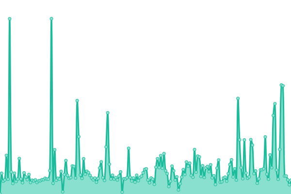 2246ms
     
 | 

<a href="https://status.cubari.moe/history/cubari-manga-dex">94.01%</a>
    

|  Cubari (NHentai) | 🟩 Up | [cubari-n-hentai.yml](https://github.com/subject-f/cubari-status-page/commits/HEAD/history/cubari-n-hentai.yml) | 

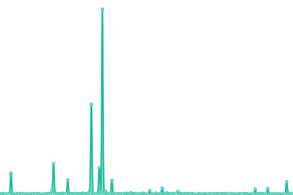 987ms
     
 | 

<a href="https://status.cubari.moe/history/cubari-n-hentai">100.00%</a>
    

|  Cubari (MangAdventure) | 🟥 Down | [cubari-mang-adventure.yml](https://github.com/subject-f/cubari-status-page/commits/HEAD/history/cubari-mang-adventure.yml) | 

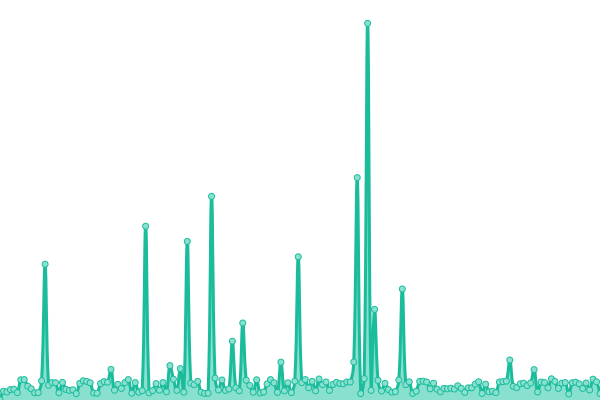 37ms
     
 | 

<a href="https://status.cubari.moe/history/cubari-mang-adventure">0.00%</a>
    

|  Cubari (Imgur) | 🟩 Up | [cubari-imgur.yml](https://github.com/subject-f/cubari-status-page/commits/HEAD/history/cubari-imgur.yml) | 

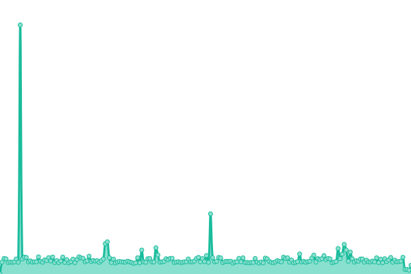 2051ms
     
 | 

<a href="https://status.cubari.moe/history/cubari-imgur">99.13%</a>
    

|  Cubari (Gist) | 🟩 Up | [cubari-gist.yml](https://github.com/subject-f/cubari-status-page/commits/HEAD/history/cubari-gist.yml) | 

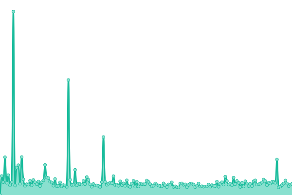 1681ms
     
 | 

<a href="https://status.cubari.moe/history/cubari-gist">100.00%</a>
    

|  Cubari (MangaKatana) | 🟩 Up | [cubari-manga-katana.yml](https://github.com/subject-f/cubari-status-page/commits/HEAD/history/cubari-manga-katana.yml) | 

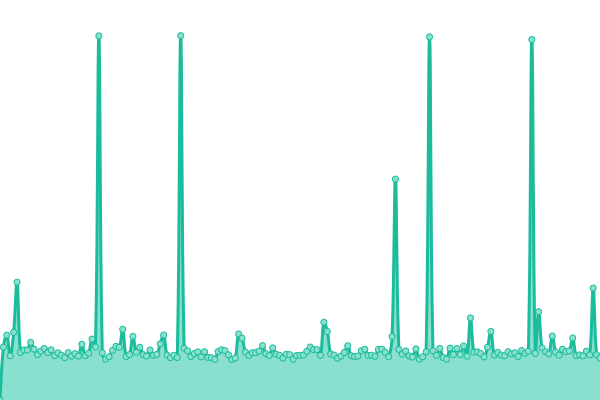 1911ms
     
 | 

<a href="https://status.cubari.moe/history/cubari-manga-katana">100.00%</a>
    

|  Cubari (WeebCentral) | 🟩 Up | [cubari-weeb-central.yml](https://github.com/subject-f/cubari-status-page/commits/HEAD/history/cubari-weeb-central.yml) | 

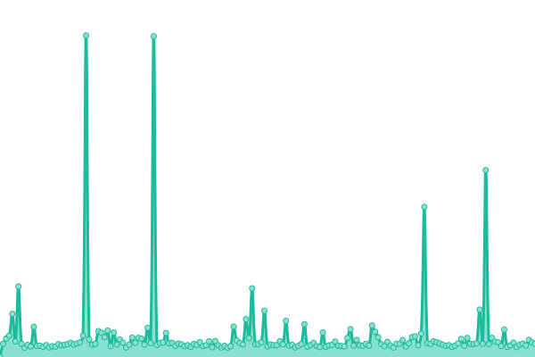 458ms
     
 | 

<a href="https://status.cubari.moe/history/cubari-weeb-central">100.00%</a>
    

|  Cubari (imgbox) | 🟩 Up | [cubari-imgbox.yml](https://github.com/subject-f/cubari-status-page/commits/HEAD/history/cubari-imgbox.yml) | 

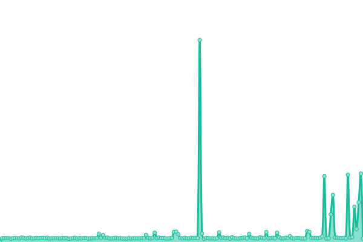 492ms
     
 | 

<a href="https://status.cubari.moe/history/cubari-imgbox">100.00%</a>
    

|  Cubari (ImageChest) | 🟩 Up | [cubari-image-chest.yml](https://github.com/subject-f/cubari-status-page/commits/HEAD/history/cubari-image-chest.yml) | 

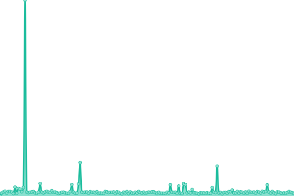 314ms
     
 | 

<a href="https://status.cubari.moe/history/cubari-image-chest">100.00%</a>
    

|  Cubari (reddit) | 🟩 Up | [cubari-reddit.yml](https://github.com/subject-f/cubari-status-page/commits/HEAD/history/cubari-reddit.yml) | 

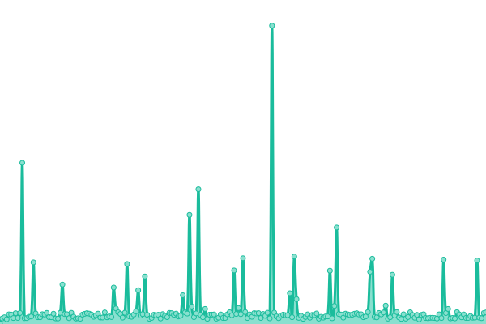 5224ms
     
 | 

<a href="https://status.cubari.moe/history/cubari-reddit">98.56%</a>
    

|  Cubari (imgBB) | 🟩 Up | [cubari-img-bb.yml](https://github.com/subject-f/cubari-status-page/commits/HEAD/history/cubari-img-bb.yml) | 

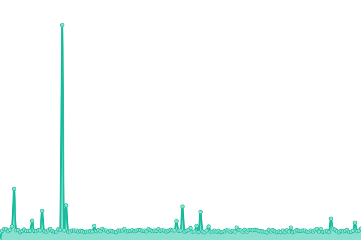 416ms
     
 | 

<a href="https://status.cubari.moe/history/cubari-img-bb">100.00%</a>
    

|  Cubari (Dynasty Scans) | 🟩 Up | [cubari-dynasty-scans.yml](https://github.com/subject-f/cubari-status-page/commits/HEAD/history/cubari-dynasty-scans.yml) | 

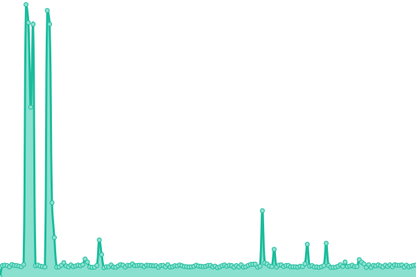 392ms
     
 | 

<a href="https://status.cubari.moe/history/cubari-dynasty-scans">100.00%</a>
    

|  Cubari (Catbox) | 🟩 Up | [cubari-catbox.yml](https://github.com/subject-f/cubari-status-page/commits/HEAD/history/cubari-catbox.yml) | 

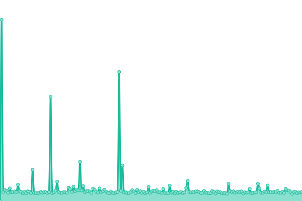 491ms
     
 | 

<a href="https://status.cubari.moe/history/cubari-catbox">100.00%</a>
    

<!--end: status pages-->

[**Visit our status website →**](https://status.cubari.moe)

## 📄 License

- Powered by: [Upptime](https://github.com/upptime/upptime)
- Code: [MIT](./LICENSE) © [Subject F](https://status.cubari.moe)
- Data in the `./history` directory: [Open Database License](https://opendatacommons.org/licenses/odbl/1-0/)
